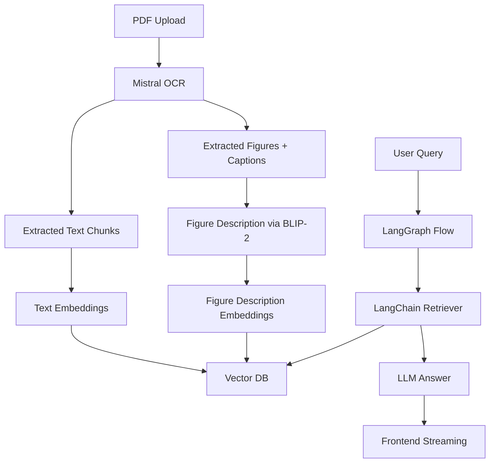

# 🧠 ScholarMind

> AI-powered academic assistant that lets you **chat with your papers** — figures included.

ScholarMind is a multimodal research tool that allows users to upload PDFs and ask natural language questions about their academic documents. It leverages **Mistral OCR**, **BLIP-2**, **LangChain**, and **LangGraph** to extract, understand, and retrieve both **text** and **figure-based insights** from papers.

---

## 🎯 Features

- 📄 Upload PDFs with structured metadata (BibTeX, author, title, etc.)
- 🔎 Extract both text and figures using **Mistral OCR**
- 🧠 Generate semantic descriptions of figures with **BLIP-2** or **GPT-4V**
- 📚 Embed everything into a **vector database** (Chroma or Qdrant)
- 🤖 Ask open-ended questions and receive context-aware answers powered by **LangChain + LangGraph**
- 🧵 Maintains conversational memory with dynamic branching (text vs figure answers)
- ⚡ Live token streaming with a FastAPI backend + React frontend

---

## 🧱 Architecture



---

## 🚀 Getting Started

### 📦 Requirements

- Docker + Docker Compose
- OpenAI API Key (for LLM + embeddings)
- Replicate API Key (optional, for BLIP-2)

### 🔧 Environment Setup

Create a `.env` file in the project root:

```env
OPENAI_API_KEY=your-key-here
REPLICATE_API_TOKEN=your-token-here
DATABASE_URL=postgresql://user:password@db:5432/scholarmind
VECTOR_DB_HOST=vector_db
```

---

### 🐳 Docker Setup

```bash
git clone https://github.com/your-username/scholarmind.git
cd scholarmind
docker-compose up --build
```

- Backend: http://localhost:8000
- Frontend: http://localhost:3000
- Vector DB (Chroma): http://localhost:8001

---

## 🛠 Project Structure

```bash
scholarmind/
├── frontend/        # React frontend
│   └── ...
├── backend/         # FastAPI + LangGraph
│   ├── main.py      # API entrypoint
│   ├── graph.py     # LangGraph DAG
│   ├── rag.py       # LangChain RAG logic
│   └── captioning.py# BLIP-2 figure captioning
├── docker-compose.yaml
├── .env
└── README.md
```

---

## ✨ Example Queries

> "What does the architecture in Figure 3 show?"  
> "How does the model differ from standard diffusion pipelines?"  
> "Summarize the contributions of this paper."  
> "What dataset was used in the experiments section?"

---

## 🧪 Technologies Used

| Component      | Tool / Library                       |
|----------------|--------------------------------------|
| OCR            | [Mistral OCR](https://mistral.ai/news/mistral-ocr) |
| Image Captioning | [BLIP-2](https://huggingface.co/Salesforce/blip2) / GPT-4V |
| Embeddings     | OpenAI (`text-embedding-3-small`) or BGE |
| RAG Engine     | LangChain                            |
| Orchestration  | LangGraph                            |
| Vector DB      | ChromaDB / Qdrant                    |
| Backend        | FastAPI                              |
| Frontend       | React + Tailwind                     |
| Deployment     | Docker + Docker Compose              |

---

## ✅ Roadmap

- [x] Mistral OCR parsing
- [x] BLIP-2 figure description
- [x] Vector embedding pipeline
- [x] LangChain RAG + LangGraph DAG
- [x] FastAPI + SSE streaming
- [x] React chat interface
- [ ] Add citation/source view
- [ ] Paper summarization tool
- [ ] Figure-only visual search
- [ ] User accounts + paper history
- [ ] Deploy to HuggingFace Spaces / Railway

---

## 💡 Contributing

We welcome contributions! Please open issues or PRs if you'd like to help improve ScholarMind.  
For major changes, open a discussion first.

---

## 📝 License

MIT License

---

## 📬 Contact

Made by [Your Name]  
Reach out via [your-email@example.com] or [linkedin.com/in/yourname](#)
